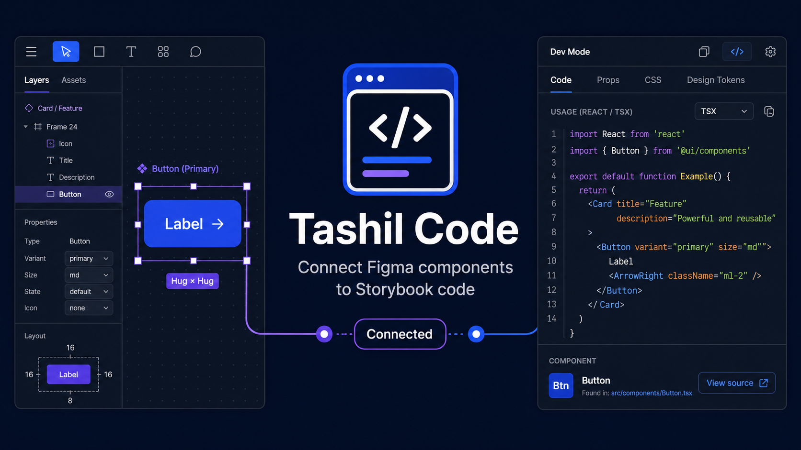

# Tashil Code

Figma Dev Mode plugin for connecting Figma components to Storybook-backed production components.

The plugin has two workflows:

- **Connect component**: used by design-system owners to save code-generation metadata and optional Storybook/source references on a Figma main component or component set.
- **Tashil UI codegen**: used by developers in Dev Mode to see a React/TSX usage snippet for the selected component.

Only **Component name** and **Import path** are required when creating a connection.
**Storybook URL**, **Source path**, **Source URL**, and **Prop mappings JSON** are optional.
Generated components use a configurable Figma text property (`label` by default),
an explicitly imported icon child, or no children with self-closing JSX. See the
[connection guide](docs/connect-component.md) for the exact behavior and stored
metadata shape.

## Development

```sh
npm install
npm run build
```

For continuous builds while testing in Figma:

```sh
npm run watch
```

Import `manifest.json` in Figma from:

`Plugins > Development > Import plugin from manifest...`

> **`manifest.json` is generated**, not hand-written. `npm run build` regenerates
> it from the `figma-plugin` field in `package.json`. Edit that field (then
> rebuild) to change the plugin name, menu, or capabilities — never edit
> `manifest.json` directly.

## Guides

- [How to connect a component](docs/connect-component.md)
