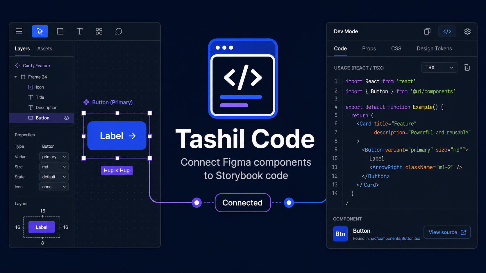

# Tashil Code

Tashil Code is a Figma Dev Mode plugin for connecting Figma components to their
production React components. It lets design-system owners map real source props
to Figma component properties, then gives developers a copyable TSX snippet and
reference links in Dev Mode.

## What it does

- Upload local `.ts` and `.tsx` source files to discover a component's props.
- Visually map source props and values to Figma variant, boolean, text, and
  instance-swap properties.
- Generate React/TSX for the Figma instance currently selected in Dev Mode.
- Generate a complete styled-components React module for a selected frame,
  group, section, or text layer, including its nested connected components.
- Store optional Storybook and source references alongside the connection.
- Detect source and Figma drift so mappings can be reviewed before they break.

The plugin has two workflows:

- **Connect component** — design-system owners select a main component or
  component set and save its code-generation metadata.
- **Tashil UI codegen** — developers select a connected instance for its usage
  snippet, or a design frame for complete styled-components React output.

Only **Component name** and **Import path** are required. Storybook and source
references are optional. Source parsing happens locally: the plugin saves the
extracted prop schema and a content hash, never the uploaded source text.

## React layout generation

When you select a frame, group, section, or text layer in Figma Dev Mode
(using the **Tashil UI** codegen language) or open **Inspect Code** in the
plugin's Design mode, Tashil Code generates one complete styled-components
`.tsx` module:

```tsx
import styled from "styled-components";
import colors from 'styles/colors';
import { Button } from "@tashilcar/swiss-army-knife";

const PaymentFormRoot = styled.div`
  display: flex;
  flex-direction: column;
  color: ${colors.text.default};
  background: ${colors.background.neutral.default};
  gap: var(--spacing-400, 1rem);
  padding: var(--spacing-600, 1.5rem);
`;

export function PaymentForm() {
  return (
    <PaymentFormRoot>
      <Button variant={"primary"}>Submit</Button>
    </PaymentFormRoot>
  );
}
```

The generated tree preserves visible frame/group/section/text layers in
document order. Connected instances become their real production React usages
and remain atomic—the generator never expands component internals. Figma CSS
color variables are converted to references from the frontend
`styles/colors` token object. Variables for layout, typography, radii, and
effects retain their CSS custom-property references inside generated styled
declarations. Unconnected components are reported as JSX markers and generation
notes instead of being silently expanded.

Inspect Code also separates application-owned runtime requirements from
generation diagnostics and shows counts for unresolved components, unsupported
assets, and omitted declarations.

Bound structural variables for gap, padding, width, and height are also
reconstructed when Figma CSS is unavailable, using the same kebab-case naming
contract as Sync Tokens and retaining measured pixel fallbacks.

Freeform frames establish a relative positioning context. Their ordinary
children, and absolute children inside auto layout, retain supported Figma-local
coordinates and dimensions as positioned styled components.

Dev Mode also keeps the selected layer's token-aware **Layout** and **Style**
CSS inspection blocks from Figma's own CSS engine.

See [Generate and inspect a frame](docs/inspect-frame.md) for the full guide.

## Documentation

- [Section guide](docs/sections-index.md) — engineer/agent onboarding: the five
  `src/` sections, their module maps, the rules each one enforces, and the
  global invariants. Read the matching `docs/section-*.md` before editing a
  section.
- [Project brief](docs/project-brief.md) — product scope, runtime flow,
  architecture, privacy model, and frame-inspection status.
- [Generate and inspect a frame](docs/inspect-frame.md) — full styled-components
  output, connected-component boundaries, and selected-layer CSS inspection.
- [Connect a component](docs/connect-component.md) — setup from Figma selection
  to Dev Mode output.
- [Visual prop mappings](docs/prop-mapping.md) — source/Figma mapping rules,
  labels, icon slots, advanced mappings, and the Switch example.
- [Maintain a connection](docs/maintain-connections.md) — source and Figma drift,
  health states, and reconciliation.
- [Development guide](docs/development.md) — local setup, project structure,
  testing, and loading the plugin in Figma.
- [Changelog](CHANGELOG.md) — notable changes by release.

## Development

```sh
npm install
npm run build
```

For continuous builds while testing in Figma:

```sh
npm run watch
```

To run the full local verification suite:

```sh
npm run typecheck
npm test
npm run lint
npm run build
```

Import `manifest.json` in Figma from:

`Plugins > Development > Import plugin from manifest...`

> **`manifest.json` is generated**, not hand-written. `npm run build` regenerates
> it from the `figma-plugin` field in `package.json`. Edit that field (then
> rebuild) to change the plugin name, menu, or capabilities — never edit
> `manifest.json` directly. It is checked in on purpose (like `package-lock.json`)
> so the shipped plugin matches committed source, and CI's `git diff --exit-code`
> step fails if it drifts — so after rebuilding, commit the regenerated
> `manifest.json` along with your `package.json` change.

## Project map

- `src/main.ts` — Figma plugin entry point, connection persistence, selection
  reads, and Dev Mode codegen registration.
- `src/ui.tsx` — Connect Component and Inspect Code screens.
- `src/ui-controller.ts` and `src/ui-state.ts` — UI state, source upload, saves,
  reconciliation, and form validation.
- `src/source-schema.ts` — local TypeScript prop extraction.
- `src/mapping-editor.ts` and `src/mapping-document.ts` — visual mapping
  authoring state and compilation to runtime JSON.
- `src/codegen.ts` — generated imports, TSX, and mapping diagnostics.
- `src/connection-health.ts` — source/Figma drift detection and health status.
- `src/inspect/` — Dev-Mode-parity selected-layer inspection: Layout/Style CSS
  partitioning of `getCSSAsync()` output and connected-component enumeration.
- `src/layout/` — full selected-tree styled-components React generation, component
  resolution, traversal limits, naming, and import rendering.
