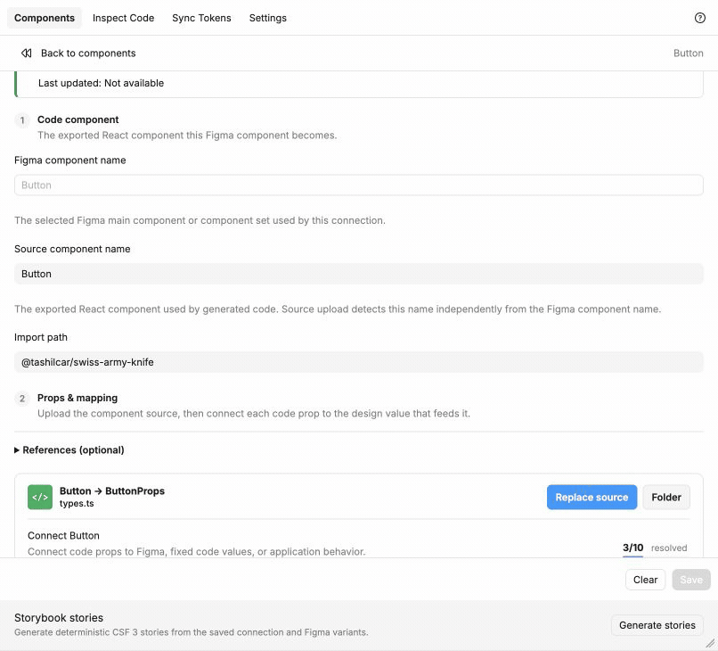

# Tashil Code

> 📐 **[Install on Figma Community →](https://www.figma.com/community/plugin/1654920127584180700/tashil-code)**
> A Figma Dev Mode plugin that connects your design system to your production
> React library.

Tashil Code connects your Figma design system to your production React library.
Map real component props, generate accurate TSX, convert layouts into
styled-components, and export Figma Variables in CSS, JSON, SCSS, or Tailwind
formats.

Design-system owners author the connections once; developers get copyable,
source-accurate code in Dev Mode. The plugin runs in both the Figma Design
editor and Dev Mode (`editorType: ["figma", "dev"]`).



The demo uses the real browser harness and the same typed UI/controller path as
the Figma plugin. Inspect Code and Dev Mode share the production generation
pipeline.

## Five-minute quick start

1. [Install Tashil Code from Figma Community](https://www.figma.com/community/plugin/1654920127584180700/tashil-code).
2. Open a Figma file with a main component, select it, and run **Tashil Code →
   Connect component**.
3. Enter the exported React component name and import path. Upload its local
   `.ts` or `.tsx` props source if you want guided mappings, then save.
4. Select an instance or frame. Use **Inspect Code** in Design mode, or choose
   **Tashil UI** in Dev Mode, and copy the generated TSX.

Want a runnable code target first? The
[standalone React companion](examples/quickstart/README.md) builds independently
and contains an upload-ready Button plus representative generated output. The
[Community demo publication guide](docs/community-demo.md) defines the matching
Figma starter file and cold-run checklist.

## What it does

- Upload local `.ts` and `.tsx` source files to discover a component's props.
- Visually map source props and values to Figma variant, boolean, text, and
  instance-swap properties.
- Generate React/TSX for the Figma instance currently selected in Dev Mode.
- Generate a complete styled-components React module for a selected frame,
  group, section, or text layer, including its nested connected components.
- Export Figma Variable collections as CSS, flat JSON, DTCG JSON, SCSS, or
  Tailwind token files, with a local diff against the previous export.
- Store optional Storybook and source references alongside the connection.
- Detect source and Figma drift so mappings can be reviewed before they break.

The plugin has four workflows, surfaced as tabs in the plugin window
(Design mode) and as the **Tashil UI** codegen language (Dev Mode):

- **Connect component** — design-system owners select a main component or
  component set, map its source props to Figma properties, and save the
  code-generation metadata.
- **Inspect Code** — preview the generated output for a selected frame, group,
  section, or text layer (Layout/Style CSS + connected components) without a
  Dev Mode seat.
- **Sync Tokens** — export Figma Variable collections in five output formats
  (one file per collection × mode).
- **Settings** — configure user-local formatting and copy preferences without
  changing the Figma document.

In **Dev Mode**, selecting a connected instance yields its usage snippet and
selecting a frame yields a complete styled-components React module.

Only **Component name** and **Import path** are required. Storybook and source
references are optional. Source parsing happens locally: the plugin saves the
extracted prop schema and a content hash, never the uploaded source text.

## React layout generation

When you select a frame, group, section, or text layer in Figma Dev Mode
(using the **Tashil UI** codegen language) or open **Inspect Code** in the
plugin's Design mode, Tashil Code generates one complete styled-components
`.tsx` module:

```tsx
import styled from "styled-components";
import colors from 'styles/colors';
import { Button } from "@tashilcar/swiss-army-knife";

const PaymentFormRoot = styled.div`
  display: flex;
  flex-direction: column;
  color: ${colors.text.default};
  background: ${colors.background.neutral.default};
  gap: var(--spacing-400, 1rem);
  padding: var(--spacing-600, 1.5rem);
`;

export function PaymentForm() {
  return (
    <PaymentFormRoot>
      <Button variant={"primary"}>Submit</Button>
    </PaymentFormRoot>
  );
}
```

The generated tree preserves visible frame/group/section/text layers in
document order. Connected instances become their real production React usages
and remain atomic—the generator never expands component internals. Figma CSS
color variables are converted to references from the frontend
`styles/colors` token object. Variables for layout, typography, radii, and
effects retain their CSS custom-property references inside generated styled
declarations. Unconnected components are reported as JSX markers and generation
notes instead of being silently expanded.

Inspect Code also separates application-owned runtime requirements from
generation diagnostics and shows counts for unresolved components, unsupported
assets, and omitted declarations.

Bound structural variables for gap, padding, width, and height are also
reconstructed when Figma CSS is unavailable, using the same kebab-case naming
contract as Sync Tokens and retaining measured pixel fallbacks.

Freeform frames establish a relative positioning context. Their ordinary
children, and absolute children inside auto layout, retain supported Figma-local
coordinates and dimensions as positioned styled components.

Dev Mode also keeps the selected layer's token-aware **Layout** and **Style**
CSS inspection blocks from Figma's own CSS engine.

See [Generate and inspect a frame](docs/inspect-frame.md) for the full guide.

## Documentation

| Doc | What it covers |
| --- | --- |
| [Section guide](docs/sections-index.md) | Engineer/agent onboarding: the five `src/` sections, their module maps, the rules each enforces, and global invariants. Read the matching `docs/section-*.md` before editing a section. |
| [Project brief](docs/project-brief.md) | Product scope, runtime flow, architecture, privacy model, and frame-inspection status. |
| [Generate and inspect a frame](docs/inspect-frame.md) | Full styled-components output, connected-component boundaries, and selected-layer CSS inspection. |
| [Connect a component](docs/connect-component.md) | Setup from Figma selection to Dev Mode output. |
| [Visual prop mappings](docs/prop-mapping.md) | Source/Figma mapping rules, labels, icon slots, advanced mappings, and the Switch example. |
| [Maintain a connection](docs/maintain-connections.md) | Source and Figma drift, health states, and reconciliation. |
| [Development guide](docs/development.md) | Local setup, project structure, testing, and loading the plugin in Figma. |
| [Changelog](CHANGELOG.md) | Notable changes by release. |
| [Privacy policy](PRIVACY.md) | Exactly what stays in shared plugin data, user-local storage, memory, downloads, and the clipboard. |
| [Community demo guide](docs/community-demo.md) | Publication and cold-run checklist for the five-minute Figma starter file. |

## Setup

### Prerequisites

- **Node.js 22** or later (pinned in [`.nvmrc`](.nvmrc); `nvm use` will pick it
  up). The build is not tested on older Node.
- **npm** (ships with Node).
- A Figma account with permission to import a development plugin.

### Install

```sh
npm install
```

### Build

```sh
npm run build
```

This runs the TypeScript typecheck and writes the plugin bundle to `build/`
(`build/main.js`, `build/ui.js`). It also regenerates `manifest.json` from the
`figma-plugin` field in `package.json`.

For continuous rebuilds while testing in Figma:

```sh
npm run watch
```

### Load the plugin in Figma

1. Build at least once (`npm run build`).
2. In the Figma desktop app, open
   **Plugins → Development → Import plugin from manifest…**.
3. Choose this repository's [`manifest.json`](manifest.json).
4. The plugin is now available under
   **Plugins → Development → Tashil Code**.

> After every local rebuild, **reload the development plugin in Figma** before
> testing the new bundle — Figma caches the old code until you do. Use the
> "Run" entry on the plugin's development page, or close and reopen it.

## Using the plugin

Tashil Code runs in **both** Figma editors (`editorType: ["figma", "dev"]`).
Authoring happens in **Design mode**; generated code is consumed in **Dev Mode**.
See [Figma Editor Modes](docs/section-editor-modes.md) for the boundary.

### Design mode — author connections

1. Select a main component, component set, or instance on the canvas.
2. Run **Plugins → Development → Tashil Code → Connect component**.
3. In the plugin window:
   - Upload the component's local `.ts`/`.tsx` source to discover its props.
   - Visually map source props to Figma properties, or author a semantic recipe
     when the structures don't match.
   - Optionally attach Storybook / source reference links.
   - Save. Only **Component name** and **Import path** are required.
4. Use the **Inspect Code** tab to preview the generated output without a Dev
   Mode seat, and the **Sync Tokens** tab to export Figma Variable collections
   in CSS, JSON, SCSS, or Tailwind formats.

Source parsing is local: the plugin stores the extracted prop schema and a
content hash, never the uploaded source text. See
[Connect a component](docs/connect-component.md) and
[Sync Tokens](docs/sync-tokens.md).

### Dev Mode — consume generated code

1. In Dev Mode, select a connected instance (or a frame/group/section/text layer).
2. Choose **Tashil UI** in the Code section.
3. Copy the generated TSX / styled-components module.

A connected instance yields its usage snippet; a design frame yields a complete
styled-components `.tsx` module with connected instances as atomic usages. Dev
Mode reads connections — it never authors them.

## `manifest.json` is generated

`manifest.json` is regenerated by `npm run build` from the `figma-plugin` field
in `package.json`. **Never edit it by hand.** To change the plugin name, menu,
capabilities, or codegen languages, edit the `figma-plugin` field in
`package.json`, rebuild, and commit the regenerated `manifest.json` alongside
the `package.json` change.

It is checked in on purpose (like `package-lock.json`) so the shipped plugin
matches committed source. CI's `git diff --exit-code` step fails if
`manifest.json` drifts from a clean rebuild — so an uncommitted regeneration
will break CI.

## Verify changes

Run the full local verification suite before handing off a change:

```sh
npm run typecheck   # 4 tsconfig contexts (main, ui, tests, plugin-tests)
npm test            # vitest run
npm run lint        # eslint .
npm run build       # typecheck + build-figma-plugin --minify
```

Tests use Vitest. UI interaction tests run with Preact Testing Library and
jsdom; plugin-side tests cover Figma API behavior with local test doubles. See
[Development guide](docs/development.md) for details.

## Project map

- `src/main.ts` — Figma plugin entry point, connection persistence, selection
  reads, and Dev Mode codegen registration.
- `src/ui.tsx` — Connect Component and Inspect Code screens.
- `src/ui-controller.ts` and `src/ui-state.ts` — UI state, source upload, saves,
  reconciliation, and form validation.
- `src/source-schema.ts` — local TypeScript prop extraction.
- `src/mapping-editor.ts` and `src/mapping-document.ts` — visual mapping
  authoring state and compilation to runtime JSON.
- `src/codegen.ts` — generated imports, TSX, and mapping diagnostics.
- `src/connection-health.ts` — source/Figma drift detection and health status.
- `src/inspect/` — Dev-Mode-parity selected-layer inspection: Layout/Style CSS
  partitioning of `getCSSAsync()` output and connected-component enumeration.
- `src/layout/` — full selected-tree styled-components React generation, component
  resolution, traversal limits, naming, and import rendering.
